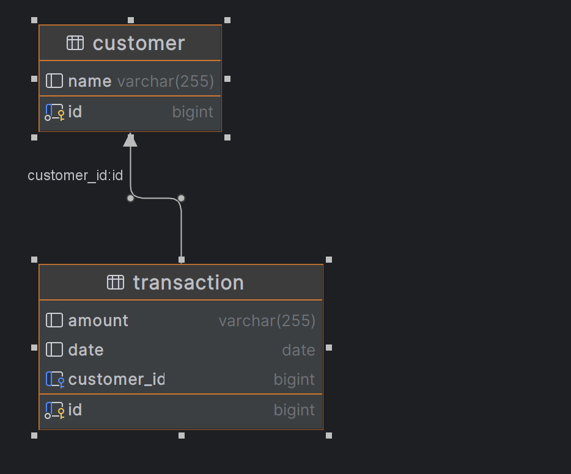

## Reward System

### DB



### How to run the code
1. Clone the repository
2. Run the following command in the terminal
```bash
mvn spring-boot:run
```
NOTE: default port is changed to 8090 in the application.properties file
3. Open the browser and go to the following URL
```bash
http://localhost:8090
```

### Endpoints

```bash
POST /customer  - create a new customer record

POST /transaction - create a new transaction record

GET /transactions/{customerId} - get transaction records by customer id

GET /calculateRewards/{customerId} - calculate rewards by customer id
```


### Sample Requests and Responses

To create a new customer record
```bash
curl -X POST --location "http://localhost:8090/customer" \
    -H "Content-Type: application/json" \
    -d '{
        "name": "user13"
        }'
```

To create a new transaction record by customer id
```bash
curl -X POST --location "http://localhost:8090/transaction" \
    -H "Content-Type: application/json" \
    -d '{
  "amount": "201",
  "date": "2022-05-21",
  "customerId": 19
}'
```

To get trasaction records by customer id, here 12 is the customer id
```bash
curl -X GET --location "http://localhost:8090/transactions/12"
```

### response
NOTE: sorted by date in descending order

we will get the response in the following format
```json
[
  {
    "id": 184,
    "amount": 892.0,
    "date": "2023-12-15"
  },
  {
    "id": 207,
    "amount": 186.0,
    "date": "2023-11-08"
  },
  {
    "id": 49,
    "amount": 536.0,
    "date": "2023-08-22"
  }
]
```

### Reward Calculation

```bash
curl -X GET --location "http://localhost:8090/calculateRewards/12"
```

### response

```json
{
  "totalPoints": 12070,
  "pointsPerMonth": {
    "2023-8": 2416,
    "2023-11": 222,
    "2023-6": 1518,
    "2023-12": 1634,
    "2023-7": 1338,
    "2022-11": 1214,
    "2022-8": 228,
    "2022-12": 684,
    "2023-5": 1638,
    "2022-1": 1178
  }
}
```
